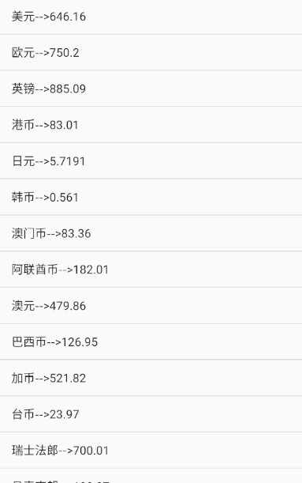
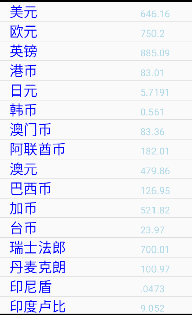

# 2021.9.26
关于startActivityForResult和setResult逻辑
A页面总是需要打开B进行配置，配置后回到A页面。
当A跳转到B时采用startActivityForResult 声明requestCode
B 获取从A来的intent,结束相关代码后 setResult 声明resultCode 并且finish 自动跳转到A页面
A判断一下是不是自己的请求 requestCode  是不是B完成了resultCode 从data中拿到返回的数据
注意：
protected void onActivityResult(int requestCode, int resultCode, @Nullable Intent data) 
就是从这个data里拿数据，不需要再getIntent啥的。就是这个我搞错了好久

整了一下bundle 用了一些挺简单的功能

# 2021.9.27
增加了menu和矢量图标的使用，其他没啥，very easy

# 2021.9.28
永久数据的配置，很简单的，但是保存的数据类型也是非常简单的数据 

getSharedPreferences读取的配置文件是在app空间内的。 

为了效率，主线程无法从事耗时的工作，例如上网
采用okhttp 注意编码问题，一定要再response转成string时声明编码，在请求的时候声明编码没有意义 

上网权限：    <uses-permission android:name="android.permission.INTERNET"/>
允许用get获取数据  在application内补充 android:usesCleartextTraffic="true"

Response response = client.newCall(request).execute();
if(response.isSuccessful() ){
String responseData = new String(response.body().bytes(), "gb2312");
Log.d("Main",responseData);
}else {
throw new IOException("Response  :    ---------------------- " + response);
}
效果如下:

# 2021.9.29

Jsoup比okhttp获取数据更方便，不用考虑编码问题

需要注意document的类型 org.jsoup.nodes.Document

# 2021.9.30

线程中获取时间与当前运行app的时间比对，相同则无处理，不相同就需要再爬取网页获取汇率，保存汇率和日期到myRate文件

# 2021.10.12

获取国家名称和汇率，用listview(listActivity)展示，使用类内和类外的runnable在MyListActivity,MyTask实现，效果如下

美化listActivity，item的xml是item_country.xml, 对应的adapter是StrAdapter，只是更改了颜色，整了一下排版

# 2021.10.13
上课的时候讲了这个adapter,所以按照上课的节奏再来一遍
上课讲的是hashmap 和simpleAdapter的配对,我熟悉的是ArrayAdapter<obj> 

今天讲的东西都挺简单的，没啥好说的，我直接push了